# CHATTA

```
 ██████╗██╗  ██╗ █████╗ ████████╗████████╗ █████╗
██╔════╝██║  ██║██╔══██╗╚══██╔══╝╚══██╔══╝██╔══██╗
██║     ███████║███████║   ██║      ██║   ███████║
██║     ██╔══██║██╔══██║   ██║      ██║   ██╔══██║
╚██████╗██║  ██║██║  ██║   ██║      ██║   ██║  ██║
 ╚═════╝╚═╝  ╚═╝╚═╝  ╚═╝   ╚═╝      ╚═╝   ╚═╝  ╚═╝

🏁 Natural Voice Conversations for AI Assistants 🏁
━━━━━━━━━━━━━━━━━━━━━━━━━━━━━━━━━━━━━━━━━━━━━━━━
Building Unified Multi-agent Business Applications
Professional • Intelligent • Secure • Enterprise-Ready
```

<<<<<<< Updated upstream
## 🏁 What is CHATTA?

**CHATTA** (Conversational Hybrid Assistant for Text-To-Audio) enables natural voice conversations with Claude Code and other AI assistants through the Model Context Protocol (MCP). Speak naturally, get responses in voice - it's that simple. Part of the **BUMBA Platform** suite of enterprise-ready development tools.

=======
[](https://github.com/mbailey/chatta)
[](https://python.org)
[](LICENSE)
[](https://bumba.ai)

## 🏁 What is CHATTA?

**CHATTA** (Conversational Hybrid Assistant for Text-To-Audio) enables natural voice conversations with Claude Code and other AI assistants through the Model Context Protocol (MCP). Speak naturally, get responses in voice - it's that simple. Part of the **BUMBA Platform** suite of enterprise-ready development tools.

>>>>>>> Stashed changes
## 🟢 Quick Start

```bash
# One-command install
curl -fsSL https://chatta.ai/install | bash

# Or pip install + setup
pip install chatta
chatta setup --express  # Recommended: auto-detects services
```

## 🟡 Core Features

### Voice Capabilities
- **OpenAI API** - Cloud TTS/STT with multiple voices
- **Whisper.cpp** - Local speech-to-text (no API needed)
- **Kokoro TTS** - Local text-to-speech with 50+ voices
- **LiveKit** - Real-time WebRTC communication

### Smart Integration
- **MCP Tools** - Seamless Claude Code integration
- **Auto-Detection** - Finds existing services automatically
- **Failover** - Switches providers on failure
- **Multi-Format** - PCM, MP3, WAV, FLAC, AAC, Opus

## 🔴 Key Enhancements

- **60% Faster** - Sub-2-second response times vs 3.5s traditional
- **Zero Cost** - Local processing eliminates API fees ($34k+ annual savings)
- **Smart Discovery** - Auto-detects services with health monitoring
- **Optimized Pipeline** - WebRTC VAD, connection pooling, zero-copy audio
- **Enterprise Ready** - Docker orchestration with failover support

## 🟠 How It Works

```mermaid
graph LR
    A[🎙️ Your Voice] --> B[STT Service]
    B --> C[Claude/AI]
    C --> D[TTS Service]
    D --> E[🔊 Voice Response]
```



Voice → Speech-to-Text → AI Processing → Text-to-Speech → Audio Response

## 🟢 Installation

**Requirements:** Python 3.10+, FFmpeg, Docker (optional)

```bash
# Basic setup
chatta setup --express

# Add OpenAI API key (optional)
export OPENAI_API_KEY="your-key"

# Install local services (optional)
chatta install whisper kokoro
```

## Usage

```bash
# Start voice conversation
chatta converse

# With Claude Code (auto-configures MCP)
claude converse

# Docker services
docker-compose up -d  # All services
docker-compose up whisper kokoro  # Specific services
```

## Configuration

```bash
# Environment variables
export CHATTA_MODE=local     # Prefer local services
export CHATTA_VOICE=nova     # Default voice

# Voice preferences (.voices.txt)
nova        # OpenAI voice
kokoro:af   # Kokoro voice
```

## Advanced

```bash
# Service management
chatta service status       # Check all services
chatta service start kokoro # Start specific service

# Custom endpoints
export CHATTA_TTS_URL=http://localhost:7888/v1
export CHATTA_STT_URL=http://localhost:8880/v1
```

## Troubleshooting

```bash
# Audio issues
chatta check-audio
export CHATTA_MIC_DEVICE=0

# Service issues
chatta service health
docker-compose restart

# Configuration issues
chatta check-config
chatta test-api
```

## Development

```bash
# Setup
git clone https://github.com/mbailey/chatta
make dev-install && make test
```

## 🏁 BUMBA Platform

CHATTA is part of the **BUMBA Platform** - Building Unified Multi-agent Business Applications

### Platform Components
- 🟡 **Strategy** - Product planning and coordination
- 🟢 **Backend** - Core infrastructure and services
- 🔴 **Frontend** - User interface and experience
- 🟠 **Testing** - Quality assurance and validation
- 🏁 **Completion** - Deployment and production

### Enterprise Features
- Professional development framework
- Multi-agent coordination system
- Designer-optimized workflows
- Integrated quality assurance
- Production-ready deployment

## Links

- **Documentation**: [chatta.ai/docs](https://chatta.ai/docs)
- **GitHub**: [github.com/mbailey/chatta](https://github.com/mbailey/chatta)
- **PyPI**: [pypi.org/project/chatta](https://pypi.org/project/chatta)
- **BUMBA Platform**: [bumba.ai](https://bumba.ai)

## Credits

Built upon the foundation of [VoiceMode](https://github.com/mbailey/voicemode) by [@mbailey](https://github.com/mbailey)

## License

MIT License - Part of the BUMBA Platform Suite

---

<div align="center">
<b>CHATTA</b> • Natural Voice Conversations for AI<br>
Part of the <b>BUMBA Platform</b> • Enterprise-Ready Voice Integration
</div>
