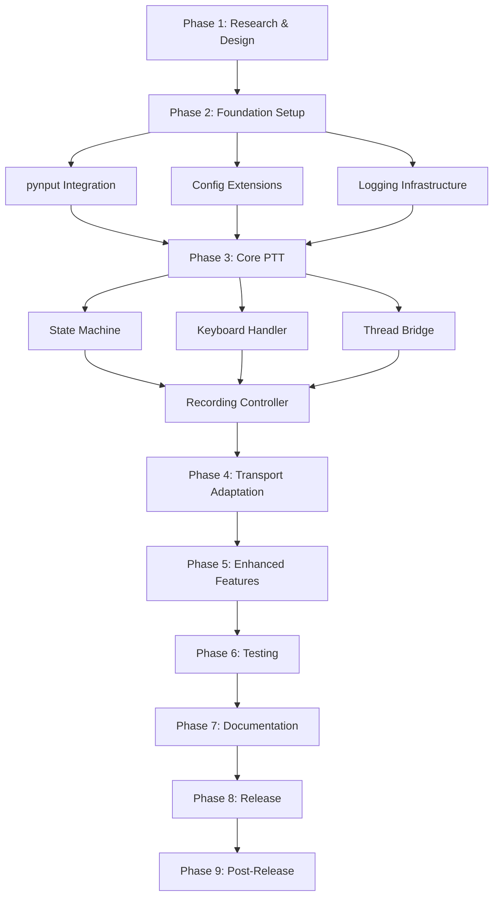

# PTT Implementation Roadmap
Date: November 9, 2025
Sprint: 1.8

## Implementation Dependency Graph



## Critical Path Analysis

### Critical Path (Sequential - Cannot Parallelize)
1. **Foundation Setup** → **Core State Machine** → **Recording Integration**
2. **Keyboard Handler** → **Thread Communication** → **Event Processing**
3. **Integration Testing** → **Documentation** → **Release**

**Total Critical Path Duration**: ~35 sprints (350 minutes)

### Parallel Work Opportunities

#### Phase 2 (Foundation)
Can parallelize:
- Config extensions
- Logging infrastructure
- Test fixtures setup
- Documentation structure

#### Phase 3 (Core PTT)
Can parallelize:
- Audio feedback sounds creation
- Error handling layer
- Cancellation support

#### Phase 5 (Enhanced Features)
Can parallelize:
- Visual feedback system
- Statistics integration
- Preset configurations
- Accessibility features

## Risk Register

### High Risk Items

| Risk | Impact | Probability | Mitigation | Contingency |
|------|--------|-------------|------------|-------------|
| macOS permission denial | High | Medium | Clear documentation, fallback mode | Revert to standard voice mode |
| pynput incompatibility | High | Low | Test early, have alternative | Use keyboard library instead |
| Thread deadlock | High | Low | Careful design, thorough testing | Kill thread, restart |
| Audio device conflicts | Medium | Medium | Device locking, recovery logic | Prompt user to retry |
| Performance regression | Medium | Low | Continuous benchmarking | Optimization sprint |

### Medium Risk Items

| Risk | Impact | Probability | Mitigation | Contingency |
|------|--------|-------------|------------|-------------|
| Key combo conflicts | Low | High | Validation, alternatives | Suggest different keys |
| Linux Wayland issues | Medium | Medium | Document limitations | X11 fallback instructions |
| Memory leaks | Medium | Low | Profiling, cleanup | Hotfix release |
| User confusion | Low | Medium | Good UX, tutorial | In-app help |

## Rollback Plan

### Phase-by-Phase Rollback Points

```python
class RollbackManager:
    """Manage rollback points during implementation"""

    rollback_points = {
        "phase_2_complete": {
            "commit": None,  # Will be set
            "description": "Foundation complete, no PTT code",
            "safe": True
        },
        "phase_3_partial": {
            "commit": None,
            "description": "PTT module isolated, not integrated",
            "safe": True
        },
        "phase_4_complete": {
            "commit": None,
            "description": "PTT integrated but disabled by default",
            "safe": True
        },
        "phase_5_complete": {
            "commit": None,
            "description": "Enhanced features, still opt-in",
            "safe": True
        },
        "pre_release": {
            "commit": None,
            "description": "Final commit before release",
            "safe": True
        }
    }

    def create_rollback_point(self, name: str):
        """Create a git tag for rollback"""
        commit = subprocess.check_output(["git", "rev-parse", "HEAD"]).decode().strip()
        self.rollback_points[name]["commit"] = commit
        subprocess.run(["git", "tag", f"rollback_{name}", commit])

    def rollback_to(self, point: str):
        """Rollback to a specific point"""
        if point not in self.rollback_points:
            raise ValueError(f"Unknown rollback point: {point}")

        commit = self.rollback_points[point]["commit"]
        if not commit:
            raise ValueError(f"Rollback point {point} not set")

        # Create backup branch
        subprocess.run(["git", "branch", "backup_before_rollback"])

        # Rollback
        subprocess.run(["git", "reset", "--hard", commit])
        print(f"✅ Rolled back to {point}: {commit}")
```

### Emergency Rollback Procedure

1. **Immediate Disable** (< 1 minute)
   ```python
   # In config.py - emergency kill switch
   CHATTA_PTT_ENABLED = False  # Disables all PTT functionality
   ```

2. **Hot Patch** (< 5 minutes)
   ```python
   # In converse.py - bypass PTT code
   if push_to_talk and not EMERGENCY_PTT_DISABLE:
       # PTT code
   else:
       # Standard flow
   ```

3. **Version Revert** (< 10 minutes)
   ```bash
   git checkout rollback_pre_release
   git push --force-with-lease
   ```

## Implementation Schedule

### Week 1: Foundation & Core
- **Day 1-2**: Phase 2 (Foundation Setup)
- **Day 3-4**: Phase 3 Sprints 1-5 (Core PTT basics)
- **Day 5**: Phase 3 Sprints 6-10 (Integration)

### Week 2: Features & Testing
- **Day 1**: Phase 4 (Transport Adaptations)
- **Day 2-3**: Phase 5 (Enhanced Features)
- **Day 4-5**: Phase 6 (Testing & Quality)

### Week 3: Polish & Release
- **Day 1**: Phase 7 (Documentation)
- **Day 2**: Phase 8 (Release Preparation)
- **Day 3**: Deployment
- **Day 4-5**: Phase 9 (Post-Release Support)

## Success Criteria

### Phase Completion Criteria

#### Phase 2 (Foundation)
- [ ] pynput installed and working
- [ ] Config schema defined
- [ ] Test framework ready
- [ ] No breaking changes to existing code

#### Phase 3 (Core PTT)
- [ ] State machine functional
- [ ] Keyboard detection working
- [ ] Recording controlled by PTT
- [ ] All unit tests passing

#### Phase 4 (Transport)
- [ ] Local transport PTT working
- [ ] LiveKit fallback implemented
- [ ] Auto-selection updated
- [ ] Integration tests passing

#### Phase 5 (Enhanced)
- [ ] Visual feedback working
- [ ] Multiple modes supported
- [ ] Statistics integrated
- [ ] Performance targets met

#### Phase 6 (Testing)
- [ ] >90% test coverage
- [ ] All platforms tested
- [ ] No memory leaks
- [ ] Performance validated

#### Phase 7 (Documentation)
- [ ] User guide complete
- [ ] API documented
- [ ] Examples provided
- [ ] Migration guide ready

#### Phase 8 (Release)
- [ ] Version bumped
- [ ] Changelog updated
- [ ] Package built
- [ ] Release notes written

## Decision Points

### Go/No-Go Checkpoints

1. **After Phase 2**: Continue only if pynput works on all platforms
2. **After Phase 3**: Continue only if core PTT is stable
3. **After Phase 5**: Decide on default enablement
4. **After Phase 6**: Final go/no-go for release

### Feature Flags

```python
# Feature flags for gradual rollout
FEATURE_FLAGS = {
    "ptt_enabled": False,           # Master switch
    "ptt_hold_mode": True,          # Basic mode
    "ptt_toggle_mode": False,       # Advanced mode
    "ptt_hybrid_mode": False,       # Experimental
    "ptt_visual_feedback": True,    # UI elements
    "ptt_statistics": True,         # Metrics collection
    "ptt_presets": False,          # Preset configs
    "ptt_accessibility": False     # Accessibility features
}
```

## Communication Plan

### Stakeholder Updates

1. **Phase Completion**: Brief summary after each phase
2. **Risk Materialization**: Immediate notification
3. **Decision Points**: Request input 24h before
4. **Release**: Announcement with guide

### Documentation Updates

- Research docs: Complete ✅
- Implementation docs: During Phase 3
- User docs: During Phase 7
- API docs: During Phase 7

## Quality Gates

### Phase Exit Criteria

Each phase must meet before proceeding:

1. **Code Quality**
   - No linting errors
   - Type hints complete
   - Comments adequate

2. **Testing**
   - Unit tests passing
   - Coverage target met
   - Manual tests complete

3. **Performance**
   - Latency acceptable
   - Memory stable
   - CPU usage low

4. **Documentation**
   - Code documented
   - Changes logged
   - Decisions recorded

## Technical Debt Management

### Acceptable Debt (For Now)
- Limited platform testing (CI only)
- Basic visual feedback (enhance later)
- Simple key combinations (expand later)

### Unacceptable Debt
- Missing error handling
- No tests for core functionality
- Undocumented configuration
- Memory leaks

## Resource Requirements

### Development
- **Time**: ~10 hours over 2-3 weeks
- **Testing**: 3 platforms needed
- **Review**: 2 hours for code review

### Infrastructure
- **CI/CD**: GitHub Actions updates
- **Testing**: Virtual machines for platforms
- **Monitoring**: Error tracking setup

## Final Phase Breakdown

### Confirmed Sprint Allocation

| Phase | Sprints | Duration | Priority |
|-------|---------|----------|----------|
| 1. Research & Design | 8 | 80 min | ✅ Complete |
| 2. Foundation Setup | 6 | 60 min | Critical |
| 3. Core PTT Implementation | 10 | 100 min | Critical |
| 4. Transport Adaptations | 6 | 60 min | High |
| 5. Enhanced Features | 8 | 80 min | Medium |
| 6. Testing & Quality | 8 | 80 min | Critical |
| 7. Documentation & Polish | 6 | 60 min | High |
| 8. Release Preparation | 6 | 60 min | Critical |
| 9. Post-Release Support | 4 | 40 min | Medium |

**Total**: 62 sprints (~10.3 hours)

## Next Steps

1. ✅ Phase 1 Complete - Research & Design documented
2. ⏭️ Begin Phase 2 - Foundation Setup
3. 📋 Update project board with tasks
4. 🔄 Set up CI/CD for PTT tests
5. 📢 Communicate plan to stakeholders

---

*Implementation ready to begin. Phase 1 Research & Design complete.*