# PTT Architecture - Core Flow Design
Date: November 9, 2025
Sprint: 1.3

## State Machine Design


### State Definitions

```python
from enum import Enum, auto
from dataclasses import dataclass
from typing import Optional, Callable
import asyncio
import time

class PTTState(Enum):
    """Push-to-Talk state machine states"""
    IDLE = auto()                # Not in PTT mode
    WAITING_FOR_KEY = auto()     # Listening for PTT key
    KEY_PRESSED = auto()         # Key detected, preparing
    RECORDING = auto()           # Actively recording audio
    RECORDING_STOPPED = auto()   # Recording ended, cleanup
    RECORDING_CANCELLED = auto() # Recording cancelled by user
    PROCESSING = auto()          # Processing recorded audio

@dataclass
class PTTEvent:
    """Events that trigger state transitions"""
    type: str  # "key_down", "key_up", "timeout", "cancel", "error"
    timestamp: float
    data: Optional[dict] = None
```

## Thread Communication Architecture

```python
import asyncio
from queue import Queue
from threading import Thread, Event
from pynput import keyboard
import logging

class PTTThreadBridge:
    """Bridge between keyboard thread and async audio system"""

    def __init__(self):
        # Thread-safe communication
        self.event_queue = Queue()
        self.stop_event = Event()

        # Async side
        self.loop: Optional[asyncio.AbstractEventLoop] = None
        self.audio_future: Optional[asyncio.Future] = None

        # Keyboard listener
        self.listener: Optional[keyboard.Listener] = None
        self.key_combo = {keyboard.Key.down, keyboard.Key.right}  # Default

    def start_keyboard_listener(self):
        """Start keyboard monitoring in separate thread"""
        def on_press(key):
            if not self.stop_event.is_set():
                self.event_queue.put(PTTEvent(
                    type="key_down",
                    timestamp=time.time(),
                    data={"key": str(key)}
                ))

        def on_release(key):
            if not self.stop_event.is_set():
                self.event_queue.put(PTTEvent(
                    type="key_up",
                    timestamp=time.time(),
                    data={"key": str(key)}
                ))

        self.listener = keyboard.Listener(
            on_press=on_press,
            on_release=on_release
        )
        self.listener.start()

    async def process_events(self):
        """Process keyboard events in async context"""
        while not self.stop_event.is_set():
            try:
                # Non-blocking check for events
                if not self.event_queue.empty():
                    event = self.event_queue.get_nowait()
                    await self.handle_event(event)

                await asyncio.sleep(0.01)  # Small delay to prevent CPU spinning
            except Exception as e:
                logging.error(f"PTT event processing error: {e}")
```

## Control Flow Sequence

```mermaid
sequenceDiagram
    participant User
    participant KeyboardThread
    participant PTTController
    participant AudioRecorder
    participant STT

    User->>KeyboardThread: Press PTT Keys
    KeyboardThread->>PTTController: KEY_DOWN event
    PTTController->>PTTController: State: WAITING → KEY_PRESSED
    PTTController->>AudioRecorder: start_recording()
    AudioRecorder-->>PTTController: Recording started
    PTTController->>PTTController: State: KEY_PRESSED → RECORDING
    PTTController-->>User: 🎤 Recording indicator

    User->>KeyboardThread: Release PTT Keys
    KeyboardThread->>PTTController: KEY_UP event
    PTTController->>PTTController: State: RECORDING → RECORDING_STOPPED
    PTTController->>AudioRecorder: stop_recording()
    AudioRecorder-->>PTTController: Audio data
    PTTController->>STT: transcribe(audio)
    STT-->>PTTController: Transcribed text
    PTTController->>PTTController: State: PROCESSING → IDLE
    PTTController-->>User: Return transcribed text
```



## Async/Sync Boundary Handling

```python
class PTTController:
    """Main PTT controller with async/sync boundary management"""

    def __init__(self):
        self.state = PTTState.IDLE
        self.bridge = PTTThreadBridge()
        self.recording_task: Optional[asyncio.Task] = None
        self.audio_buffer = bytearray()

    async def enable_ptt(self, key_combo: Optional[str] = None):
        """Enable PTT mode"""
        if self.state != PTTState.IDLE:
            return

        self.state = PTTState.WAITING_FOR_KEY

        # Start keyboard listener in thread
        self.bridge.start_keyboard_listener()

        # Start event processor in async context
        asyncio.create_task(self.bridge.process_events())

    async def handle_key_down(self):
        """Handle PTT key press"""
        if self.state != PTTState.WAITING_FOR_KEY:
            return

        self.state = PTTState.KEY_PRESSED

        # Start recording in executor to avoid blocking
        loop = asyncio.get_event_loop()
        self.recording_task = loop.create_task(
            self.start_recording_async()
        )

    async def start_recording_async(self):
        """Start audio recording (async wrapper)"""
        loop = asyncio.get_event_loop()

        # Play start chime
        await self.play_feedback("start")

        # Run blocking recording in executor
        with ThreadPoolExecutor(max_workers=1) as executor:
            future = loop.run_in_executor(
                executor,
                self.record_audio_blocking
            )

            self.state = PTTState.RECORDING

            # Wait for recording to complete or be interrupted
            try:
                audio_data = await future
                return audio_data
            except asyncio.CancelledError:
                # Handle cancellation
                self.state = PTTState.RECORDING_CANCELLED
                raise

    def record_audio_blocking(self):
        """Blocking audio recording (runs in executor)"""
        import sounddevice as sd
        import numpy as np

        SAMPLE_RATE = 16000
        CHANNELS = 1
        CHUNK_SIZE = 1024

        audio_chunks = []

        def callback(indata, frames, time, status):
            if status:
                logging.warning(f"Audio callback status: {status}")
            audio_chunks.append(indata.copy())

        # This blocks until stopped externally
        with sd.InputStream(
            samplerate=SAMPLE_RATE,
            channels=CHANNELS,
            callback=callback,
            blocksize=CHUNK_SIZE
        ):
            # Wait for stop signal
            while self.state == PTTState.RECORDING:
                time.sleep(0.01)

        # Combine chunks
        if audio_chunks:
            return np.concatenate(audio_chunks, axis=0)
        return np.array([])
```

## Event Flow Optimization

### Latency Minimization
1. **Pre-buffer audio** - Start buffering before key fully pressed
2. **Parallel processing** - Chime plays while recording starts
3. **Early STT warmup** - Initialize STT during recording
4. **Async everything** - No blocking in main thread

### Resource Management
```python
class ResourceManager:
    """Manage PTT resources efficiently"""

    def __init__(self):
        self.audio_lock = asyncio.Lock()
        self.keyboard_lock = threading.Lock()
        self.active_recordings = 0

    async def acquire_audio(self):
        """Ensure exclusive audio access"""
        async with self.audio_lock:
            if self.active_recordings > 0:
                raise RuntimeError("Recording already in progress")
            self.active_recordings += 1

    async def release_audio(self):
        """Release audio resources"""
        async with self.audio_lock:
            self.active_recordings = max(0, self.active_recordings - 1)
```

## State Transition Rules

| Current State | Event | Next State | Action |
|--------------|-------|------------|---------|
| IDLE | enable_ptt | WAITING_FOR_KEY | Start listener |
| WAITING_FOR_KEY | key_down | KEY_PRESSED | Prepare recording |
| KEY_PRESSED | recording_started | RECORDING | Capture audio |
| RECORDING | key_up | RECORDING_STOPPED | Stop capture |
| RECORDING | timeout | RECORDING_STOPPED | Auto-stop |
| RECORDING | escape | RECORDING_CANCELLED | Cancel |
| RECORDING_STOPPED | processing_complete | IDLE | Return result |
| RECORDING_CANCELLED | cleanup_complete | IDLE | Clear state |

## Error Recovery

```python
class PTTErrorHandler:
    """Handle PTT-specific errors gracefully"""

    async def handle_error(self, error: Exception, state: PTTState):
        """Route errors based on state"""
        recovery_actions = {
            PTTState.KEY_PRESSED: self.recover_from_start_failure,
            PTTState.RECORDING: self.recover_from_recording_error,
            PTTState.PROCESSING: self.recover_from_processing_error,
        }

        handler = recovery_actions.get(state, self.default_recovery)
        await handler(error)

    async def recover_from_recording_error(self, error):
        """Recover from recording failures"""
        logging.error(f"Recording error: {error}")

        # Try to salvage partial recording
        # Reset audio device
        # Notify user
        # Fall back to standard mode
```

## Performance Targets

- **Key detection latency**: < 10ms
- **Recording start time**: < 50ms
- **Audio feedback delay**: < 20ms
- **Thread communication**: < 5ms
- **State transition**: < 1ms
- **Total PTT response**: < 100ms

## Memory Management

- Audio buffer: Pre-allocated 30s capacity
- Event queue: Max 100 events
- Thread pool: Single executor
- Keyboard buffer: 10 event rolling window

## Next Steps

1. Implement state machine class
2. Create thread bridge
3. Build event processor
4. Integrate with audio system
5. Add telemetry and logging